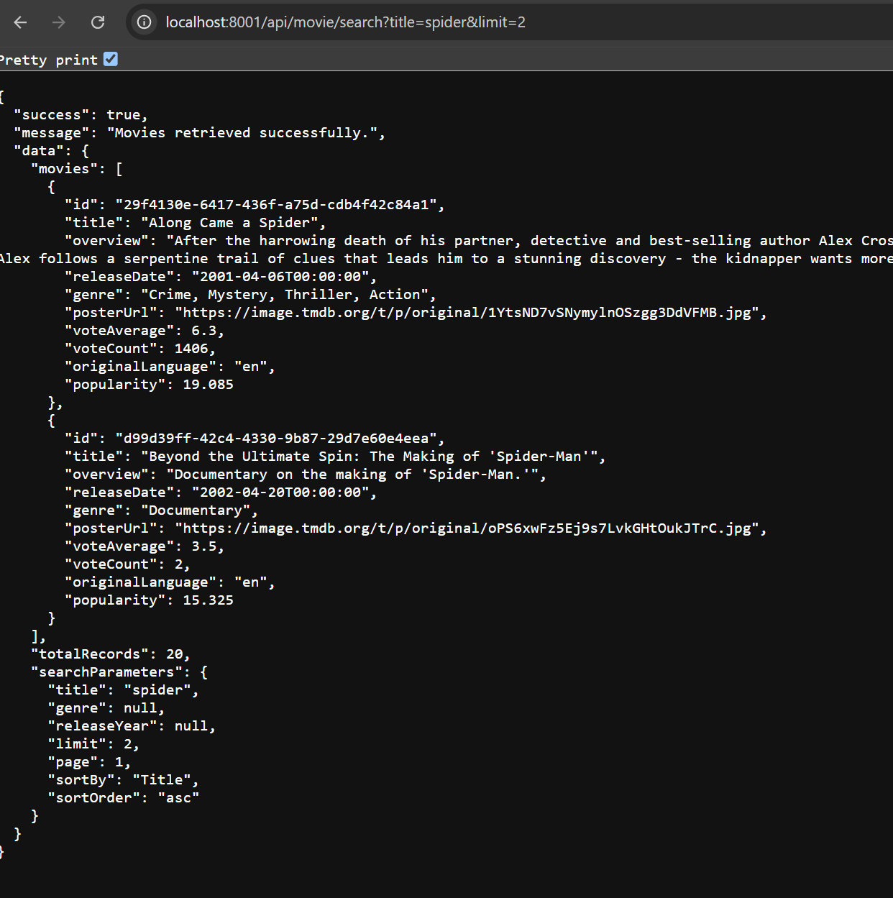
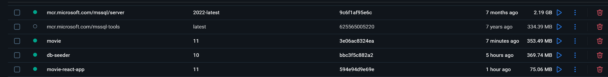
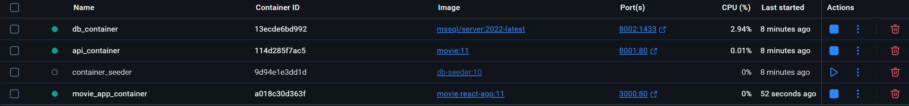
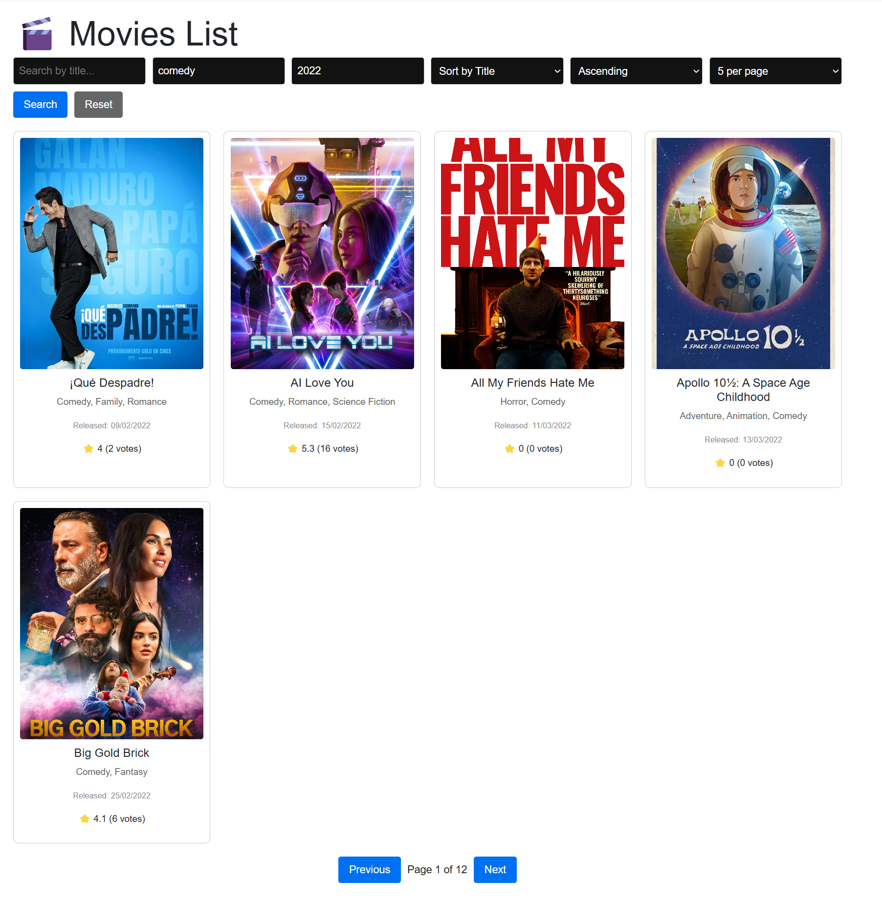
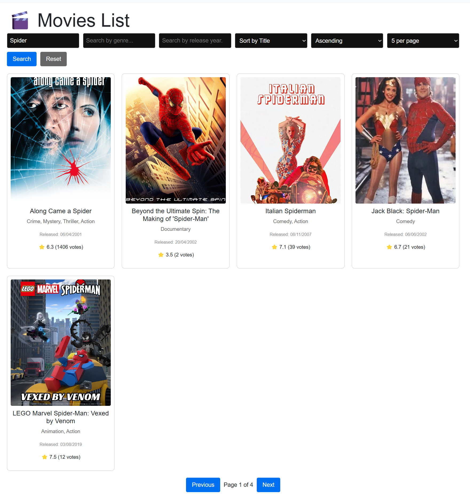

# Movies API

A simple API to search and retrieve movies with filtering, sorting, and pagination.  
It includes Docker containerization and Infrastructure as Code (IaC) with Terraform.

---

- Api .net 9 project using Repository pattern
- Use Sql server database Server=(localdb)\\mssqllocaldb
- Database is seeded from mymoviedb.csv file that can be downloaded from Url: https://www.kaggle.com/datasets/disham993/9000-movies-dataset
- Serilog for logging , create logs folder in same directory.

---

## Base URL
```
@Api_HostAddress = http://localhost:5118/api
```

---

## Endpoints

### Get All Movies (No Filters)
```http
GET {{Api_HostAddress}}/movie/search
Accept: application/json
```

### Get Movies by Genre
```http
GET {{Api_HostAddress}}/movie/search?genre=action
Accept: application/json
```

### Get Movies by Title
```http
GET {{Api_HostAddress}}/movie/search?title=Spider-Man
Accept: application/json
```

### Get Movies with Pagination
```http
GET {{Api_HostAddress}}/movie/search?title=Spider-Man&limit=15&page=1
Accept: application/json
```

### Get Movies by Genre (Comedy)
```http
GET {{Api_HostAddress}}/movie/search?genre=comedy
Accept: application/json
```

### Get Movies by Release Year
```http
GET {{Api_HostAddress}}/movie/search?releaseYear=2020
Accept: application/json
```

### Get Movies Sorted by Release Date (Ascending)
```http
GET {{Api_HostAddress}}/movie/search?sortby=ReleaseDate
Accept: application/json
```

### Get Movies Sorted by Release Date (Descending)
```http
GET {{Api_HostAddress}}/movie/search?sortby=ReleaseDate&SortOrder=desc
Accept: application/json
```

---

## Folder Structure
```
Movies.sln
.dockerignore
azure-pipeline
Dockerfile
/
|-- Api/             # ASP.NET Core Web API project
|-- DatabaseSeeder/  # console app used to seed database in terraform (IAC)
|-- IAC/             # Infrastructure as Code (Terraform scripts)
|-- Test/            # Unit and Integration tests
```

---

## Infrastructure as Code (IAC)
- The `IAC/` folder contains Terraform scripts for provisioning cloud infrastructure (e.g., App, Database).
- cd IAC
- terraform init
- terraform plan
- terraform apply --auto-approve
- this will build api project and great the api contianer and the sql db container
- open a browser and go to http://localhost:8001 

- DatabaseSeeder will run container to seed database from csv file embeded.

---

## Docker
- A `Dockerfile` is available to containerize and run the API.
- Build and run the Docker container:
  ```bash
  docker build -t movies-api .
  docker run -p 80:80 movies-api
  ```

---

## Run Locally
1. Build and run the solution using Visual Studio or .NET CLI.
2. API will be available at `http://localhost:5118/api`.

---

## React App 
1. make sure api is running
2. npm run dev
3. open the browser with the given localhost







 




---
